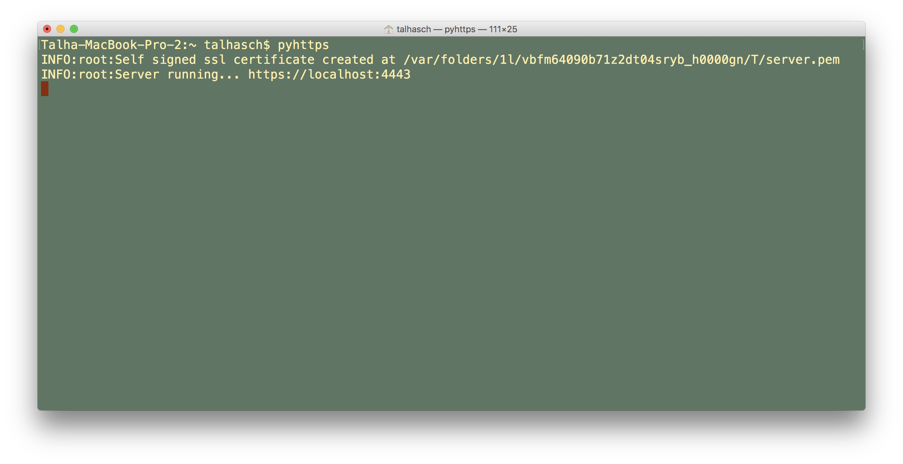

# pyhttps

Simple python https server creator.

## Installation from Pypi

Run: `pip install pyhttps`

## Installation from source

- Clone repo: `git clone https://github.com/talhasch/pyhttps && cd pyhttps`

- Run: `python setup.py install`

## Usage

Simply run `pyhttps` in the terminal

> Requires openssl installed. Tested on macOS and Ubuntu.
